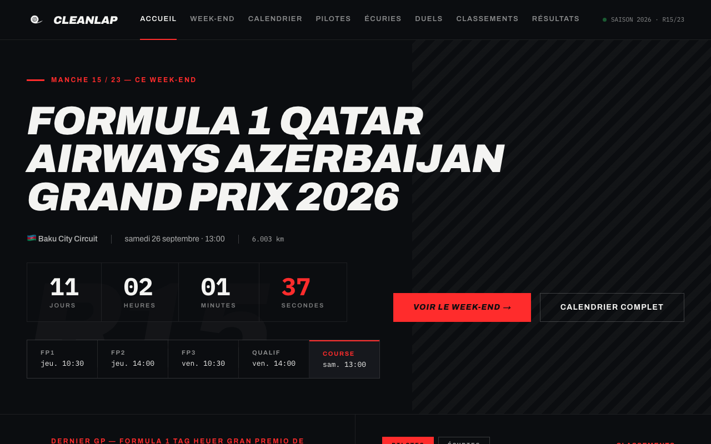

<!-- prettier-ignore -->
<div align="center">


# CleanLap

[](https://github.com/tmaurie/clean-lap/actions)

[](https://nextjs.org)
[](https://www.typescriptlang.org)

Tableau de bord de Formule 1 : la prochaine course, le week-end en direct, les classements et toutes les saisons depuis 1950.

[Fonctionnalités](#fonctionnalités) • [Démarrer](#démarrer) • [Tests](#tests) • [Architecture](#architecture) • [Dépannage](#dépannage)



</div>

CleanLap affiche l'essentiel d'une saison de F1 en un coup d'œil : le compte à rebours du prochain départ, les sessions du week-end avec leur état, le podium du dernier Grand Prix et les classements, puis toutes les saisons depuis 1950. L'application est construite avec Next.js et rendue côté serveur : le navigateur ne parle jamais directement à l'API de données.

> [!NOTE]
> Projet communautaire et non officiel. Les données viennent de l'API publique [f1api.dev](https://f1api.dev) ; CleanLap n'est affilié ni à la Formule 1 ni à la FIA.

## Fonctionnalités

- **Accueil** — compte à rebours, horaires des sessions, podium du dernier GP, top 6 des championnats et prochaines manches.
- **Week-end en cours** — sessions triées sur leurs horaires réels (le format sprint se détecte tout seul), avec leur état — terminée, en direct, à venir — et le podium de celles déjà courues.
- **Rappel avant le départ** — notification web sur demande, et export iCalendar avec une alarme une heure avant chaque session, qui fonctionne application fermée.
- **Classements** pilotes et constructeurs, et **résultats** de chaque manche : course, sprint, qualifications, essais libres.
- **Archives** saison par saison depuis 1950, avec les champions et le calendrier de chaque année.
- **Fiches** pilotes, écuries et circuits, et **comparateur** de deux pilotes sur une saison.
- **Favoris** pilotes et écuries, marqués depuis les classements ou leur fiche et retrouvés sur l'accueil.
- **Accessible et responsive** — audit WCAG 2.1 AA automatisé, animations coupées si le système le demande, aucun défilement horizontal dès 320 px.

La saison consultée vit dans l'URL (`/standings?season=2021`) : chaque vue se partage et le bouton retour fonctionne. Les horaires sont affichés en heure de Paris.

## Démarrer

### Prérequis

- [Node.js](https://nodejs.org) 22 ou plus récent
- npm (le projet est verrouillé par `package-lock.json`)

Aucune clé d'API n'est nécessaire : f1api.dev est publique.

### En local

```bash
git clone https://github.com/tmaurie/clean-lap.git
cd clean-lap
npm install
npm run dev
```

L'application est servie sur [http://localhost:3000](http://localhost:3000).

> [!TIP]
> Le premier affichage d'une page peut prendre 4 à 5 secondes : c'est le temps de réponse de f1api.dev. Les suivants sortent du cache et sont quasi instantanés — les saisons closes ne sont même jamais redemandées.

### Variables d'environnement

| Variable               | Rôle                                                                               | Défaut                        |
| ---------------------- | ---------------------------------------------------------------------------------- | ----------------------------- |
| `NEXT_PUBLIC_SITE_URL` | URL publique, utilisée pour le sitemap, `robots.txt` et les métadonnées OpenGraph. | `https://cleanlap.vercel.app` |

### Scripts

| Commande             | Effet                                          |
| -------------------- | ---------------------------------------------- |
| `npm run dev`        | Serveur de développement (Turbopack)           |
| `npm run build`      | Build de production                            |
| `npm start`          | Sert le build de production                    |
| `npm test`           | Tests unitaires (Vitest)                       |
| `npm run test:watch` | Tests unitaires en mode surveillance           |
| `npm run test:e2e`   | Tests de bout en bout et audit d'accessibilité |
| `npm run lint`       | ESLint                                         |
| `npm run typecheck`  | Vérification des types                         |
| `npm run format`     | Formatage Prettier                             |

## Tests

Deux niveaux, tous deux exécutés en CI :

- **Tests unitaires** (Vitest) — utilitaires de dates et de temps, mappers de l'API sur des réponses réelles enregistrées dans `docs/api/`, format iCalendar, stockage des favoris. Rapides : moins d'une seconde.
- **Tests de bout en bout** (Playwright) — chaque route répond, affiche son contenu et ne produit aucune erreur console, ce qui attrape les erreurs d'hydratation. S'y ajoutent un audit [axe](https://github.com/dequelabs/axe-core) WCAG 2.1 AA sur les principales routes et une vérification de l'absence de débordement horizontal de 320 à 414 px.

```bash
npx playwright install chromium   # une seule fois
npm run test:e2e
```

> [!IMPORTANT]
> Les tests de bout en bout tournent contre un **build de production** (`npm run build && npm start`), c'est-à-dire ce qui est réellement déployé. Un serveur déjà lancé sur le port 3000 est réutilisé tel quel : arrêtez `npm run dev` avant de les lancer, sinon ils s'exécutent contre le serveur de développement.

## Architecture

```
app/          Routes (App Router) et route handlers d'API
components/   Composants d'interface, regroupés par écran
features/     Logique d'affichage : manche en cours, week-end, favoris…
entities/     Types métier (course, pilote, écurie, circuit, saison)
lib/api/      Client f1api.dev, mappers et types des réponses
lib/utils/    Dates, couleurs d'écurie, drapeaux, sessions
lib/…         Export iCalendar, favoris, rappels
e2e/          Tests Playwright
docs/api/     Réponses réelles de l'API, utilisées par les tests
```

**Rendu serveur par défaut.** Les pages sont des Server Components : les données arrivent dans le HTML, sans aller-retour depuis le navigateur. Seul reste côté client ce qui est vraiment interactif : bascules, favoris, rappel, pagination des archives.

**Deux route handlers**, seuls points d'API appelés depuis le navigateur :

- `GET /api/seasons?page=` — pagination des archives, avec un cache d'une minute pour la page contenant la saison en cours et d'une heure pour les saisons closes.
- `GET /api/calendar?season=&round=` — export iCalendar d'un week-end, ou de la saison entière sans `round`.

**Cache selon la volatilité de la donnée**, dans `lib/api/client.ts` : 60 secondes pour la saison en cours, aucune revalidation pour une saison passée, une heure pour les données de référence.

> [!WARNING]
> Un `loading.tsx` met sa route en streaming : le statut HTTP part avant que la page puisse appeler `notFound()`, et un 404 devient un 200. C'est pourquoi les listes vivent dans des groupes de routes — `app/drivers/(list)/`, `app/teams/(list)/`, `app/circuits/(list)/`, `app/results/(list)/` — qui tiennent le squelette de chargement à l'écart des fiches de détail. Détails et mesures dans [`components/skeletons/README.md`](./components/skeletons/README.md).

## Dépannage

**Les tests de 404 échouent avec un 500 sur la suite complète.** Sous le volume de requêtes des tests, f1api.dev finit par répondre `403 Forbidden`, y compris sur des URL valides. Une panne en amont n'est pas un « ça n'existe pas », donc la page renvoie 500 plutôt que 404 — volontairement. Rejoués isolément, ces tests passent ; en CI, le job e2e a deux tentatives supplémentaires et reste séparé de lint, types et build.

**Une page affiche « indisponible ».** L'API a répondu en erreur. Les réponses réussies restent en cache : un rechargement quelques instants plus tard suffit généralement.

**Pas de notification malgré le rappel activé.** Une notification programmée depuis une page ne survit pas à la fermeture de l'onglet. Pour un rappel fiable, utilisez l'export agenda depuis la page Week-end : l'alarme est alors portée par votre calendrier.
